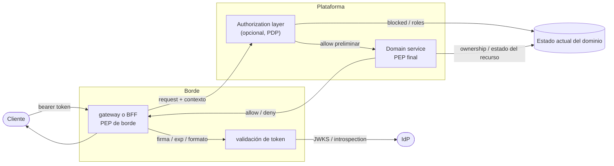
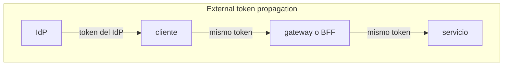
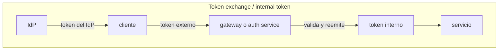

**En corto**

- Elegí `auth propia` si identidad, sesión y garantías demostrables forman parte del problema que el equipo quiere resolver.
- Elegí `IdP externo` si querés delegar login y sesión, pero asumí desde el día uno que el dominio igual tendrá que resolver bloqueo de usuarios, ownership y `fine-grained authorization`.
- Referencias rápidas: [gateways](#apéndice-gateways) e [IdP externos](#apéndice-idp-externos).

## El problema

En un monolito, login, sesión y permisos suelen sentirse como un único problema porque todo vive en la misma aplicación y comparte estado. En microservicios no: un mismo request cruza identidad, borde y dominio. Por eso **no alcanza con "poner auth en el gateway"**. ([Microservices Auth Intro][58], [Microsoft APIM Auth][60])

Por ejemplo, tomemos esta request: `POST /orders/123/cancel`.

- **Identidad.** El usuario inicia sesión contra un `IdP` o `auth service` y obtiene una sesión y un bearer token.
- **Borde.** El cliente llama a la API de entrada y el `gateway` o `BFF` (`backend-for-frontend`) decide si el request supera la primera barrera.
- **Dominio.** El servicio de `orders` consulta ownership, estado del pedido, usuario bloqueado y rol efectivo. Recién ahí decide si la operación está permitida.

El borde autentica y filtra; el dominio autoriza de verdad. En un sistema distribuido no participa una sola identidad, la confianza cambia varias veces y la decisión real necesita datos que no viven todos en el mismo lugar. ([Microservices Auth Intro][58], [Google Identity Propagation][61], [NIST API Protection][65])

Un segundo caso muestra otra clase de regla: `POST /admin/users/123/block`. Ahí ya no manda ownership, sino rol administrativo, alcance sobre la organización o tenant y trazabilidad de la acción. El token puede traer contexto inicial, pero la decisión real sigue dependiendo de política y estado actual.





---

## Preguntas clave

1. ¿Qué identidades participan en este request?
2. ¿Dónde cambia la confianza dentro del sistema?
3. ¿Cómo se propaga la identidad hasta el servicio que decide?
4. ¿Quién toma la decisión de autorización real?
5. ¿Qué datos necesita esa decisión y quién es dueño de esos datos?
6. ¿Qué queda en el token y qué obliga a consultar el estado actual del dominio?

---

## Qué resuelve cada capa

| Capa                    | Resuelve                                          | No resuelve                                       |
| :---------------------- | :------------------------------------------------ | :------------------------------------------------ |
| **IdP / auth service**  | login, sesión, recupero y emisión de token        | permisos reales de dominio                        |
| **gateway / BFF**       | validación inicial, rate limiting y filtro grueso | ownership, bloqueo de usuarios, reglas de negocio |
| **Servicio de dominio** | autorización real sobre el recurso                | login o manejo de sesión                          |
| **Datos de dominio**    | estado real: roles efectivos, ownership, flags    | enforcement por sí solos                          |

**Vocabulario mínimo**

- `AuthN`: verificar quién es.
- `AuthZ`: decidir qué puede hacer sobre un recurso.
- `BFF`: `backend-for-frontend`; una capa backend pensada para una app o canal específico.
- `Claim`: dato portable dentro del token.
- `Scope`: permiso amplio, útil para filtros iniciales.
- `Coarse-grained authorization`: “¿en principio este request podría pasar?”
- `Fine-grained authorization`: “¿esta persona puede hacer esto, sobre este recurso, ahora?” ([OAuth Resource Server][34], [OPA][32], [Keycloak Authz][33], [Curity Claims][67])

Si la autorización empieza a repetirse o a cruzar muchos servicios, puede aparecer una `Authorization Layer` o policy engine. Ahí `PDP` decide y `PEP` hace cumplir. Conviene pensarlo como una opción de madurez, no como punto de partida. ([OPA][32], [Keycloak Authz][33])

Si necesitás la versión exhaustiva de esta tabla, está en el [apéndice de matriz operativa](#apendice-matriz-operativa).

Hasta acá separamos responsabilidades. El paso siguiente es entender quién actúa en cada tramo del request y dónde cambia la confianza.

---

## Identidades y confianza

En auth distribuida no participa solo el usuario final. También existen el cliente, el `BFF`, el `gateway` y los servicios internos que se llaman entre sí.

Conviene distinguir explícitamente entre la autenticación y autorización del servicio llamador y la del usuario final. Esa diferencia importa porque un request puede transportar al mismo tiempo quién inició la acción y qué componente la está ejecutando en ese hop. ([NIST API Protection][65])

En hops internos puede importar no solo la identidad del usuario, sino también la identidad del servicio que ejecuta la acción. `User identity` y `service identity` no son lo mismo, y conviene no mezclarlas.

Los puntos que más conviene marcar en el diseño son siempre los mismos: login, emisión del primer token, entrada por `gateway` o `BFF`, hops inter-servicio y cualquier `token exchange` u on-behalf-of flow. El diagrama de identidad y acceso tiene que mostrar dónde se emiten tokens, dónde cambia la confianza y dónde aparecen esos flujos. No alcanza con saber quién inició el request; también importa qué componente lo ejecuta en cada hop y bajo qué relación de confianza. ([Azure Design Diagrams][66], [NIST API Protection][65])

**Propagación de identidad**

Con ese mapa, la siguiente decisión ya no es quién participa sino cómo llega la identidad hasta el servicio que protege el recurso.

| Diseño                              | Qué viaja hasta backend        | Ventaja principal                                              | Costo principal                                   |
| :---------------------------------- | :----------------------------- | :------------------------------------------------------------- | :------------------------------------------------ |
| **External token propagation**      | el token emitido por el `IdP`  | contexto end-to-end, mejor auditoría, menos moving parts       | más acoplamiento al proveedor                     |
| **Token exchange / internal token** | un token interno de plataforma | desacopla al `IdP` y normaliza credenciales dentro del sistema | más emisión, renovación y superficie de seguridad |

**External token propagation**

El token emitido por el proveedor cruza el borde y sigue viaje hacia backend. Propagar el `security context` end-to-end mejora la auditoría, evita cuentas genéricas privilegiadas y habilita decisiones más ricas en backend. ([Google Identity Propagation][61], [Microservices JWT Authz][68])



**Token exchange / internal token**

El borde o un `auth service` valida el token externo y lo intercambia por uno interno. Hay un mecanismo estándar para ese intercambio. También puede servir para cambiar de credencial cuando entra el request a la plataforma, desacoplar a los servicios del proveedor externo y fijar una semántica propia de plataforma. El costo es más serio: claves, expiración, renovación y más decisiones de seguridad. ([Token Exchange][54], [NIST API Protection][65])



En la práctica, esta decisión define cuánto contexto viaja end-to-end y cuánto costo operativo asumís para desacoplar la plataforma del proveedor.

---

## Autenticación en el borde

| Patrón                                     | Qué hace el borde                                        | Cuándo encaja                                                   | Límite principal                  |
| :----------------------------------------- | :------------------------------------------------------- | :-------------------------------------------------------------- | :-------------------------------- |
| **Validación local de JWT/JWKS**           | verifica firma y `claims` localmente                     | access token `JWT` y baja latencia                              | no ve estado fresco por sí solo   |
| **Introspection remota**                   | consulta online si el token está activo                  | tokens opacos o necesidad de validación revocation-aware        | más latencia y dependencia de red |
| **Delegación a servicio externo de auth**  | pregunta a un `auth service` propio                      | cuando el gateway OSS no resuelve nativamente lo que hace falta | otro hop y contrato propio        |
| **Login/sesión mediado por gateway o BFF** | el borde participa más directamente del flujo OAuth/OIDC | apps web o BFFs que concentran sesión                           | más moving parts en el borde      |

### Validación local de `JWT/JWKS`

Elegila cuando priorizás latencia y el access token ya trae suficiente contexto inicial. El patrón clásico del resource server: firma, expiración, formato y `claims` básicos se verifican localmente. Si el access token es un `JWT`, existe un perfil interoperable para ese caso. Lo que no resuelve por sí solo es revocación, usuario bloqueado, rol efectivo, ownership o reglas de negocio. ([OAuth Resource Server][34], [JWT Access Token Profile][55])

### Introspection remota

Conviene cuando necesitás estado más fresco o trabajás con tokens opacos. El borde le pregunta online al authorization server si el token está activo. Ese camino tiene un estándar claro, pero aumenta la dependencia de red y disponibilidad. ([Token Introspection][53])

### External auth

Encaja cuando querés unificar lógica común sin meterla entera en el gateway. Un patrón común es delegar la decisión inicial a un endpoint externo, por ejemplo con `ext_authz` o `ForwardAuth`. Es útil cuando el gateway OSS no trae capacidades nativas suficientes o cuando el equipo quiere concentrar autenticación común en un servicio propio. ([Envoy ext_authz][62], [Traefik ForwardAuth][29])

### gateway/BFF como cliente `OIDC`

Tiene sentido cuando el borde también administra login o sesión de una app web. El borde participa más directamente del flujo de login o sesión y puede actuar como cliente OAuth/OIDC o `Relying Party`. Conviene especialmente en aplicaciones web y BFFs. No es sinónimo de validar un bearer token ya emitido. ([OpenID Connect][40], [API Gateway Pattern][59])

Si querés bajar estos patrones a herramientas concretas, fijate el [apéndice de gateways](#apendice-gateways).

Hasta acá definiste qué contexto viaja y cómo lo valida el borde. Falta lo más difícil: con qué datos decide el dominio.

---

## Autorización distribuida

La responsabilidad primaria de autorización sigue estando en los servicios, porque son quienes protegen recursos concretos y quienes pueden acceder a datos de aplicación. En el borde solo ves el request; en el dominio ves el recurso, su estado y sus relaciones. ([Microservices JWT Authz][68])

**Ojo con esto.** Un bearer token válido no prueba que una operación esté permitida. Prueba identidad y contexto de acceso. El permiso real puede depender de ownership, estado del recurso, tenant, suspensión del usuario o reglas de negocio.

### Claims y scopes

Un `claim` es un dato que viene dentro del token. Un `scope` es un permiso de alto nivel que también puede viajar en el token y suele expresarse como una cadena tipo `orders.read`. `claims` y `scopes` sirven para `coarse-grained authorization`. Funcionan bien cuando el dato es chico, estable y suficientemente genérico para viajar en el token:

- `scope=payments.read`
- `role=admin`
- `aud=orders-api`

<details>
<summary> Esto es un ejemplo de access token</summary>

```json
{
  "iss": "https://iam.example.com",
  "sub": "user_123",
  "aud": "orders-api",
  "exp": 1765197600,
  "iat": 1765194000,
  "nbf": 1765194000,
  "jti": "01HT8M9Y7K4Q2R6W8X1Z3A5B7C",
  "client_id": "mobile-app",
  "scope": "orders.read orders.cancel",
  "role": "customer",
  "user_id": 123,
  "tenant_id": "tenant_42",
  "organization_id": "org_7",
  "amr": ["pwd", "mfa"],
  "delegation_id": "9c4b4d1a-6a66-4e56-8f76-2c5031d9a41b"
}
```

</details>

No todos los tokens llevan todos esos campos, y los nombres cambian según el `IdP` o el diseño de la plataforma. `tenant_id`, `organization_id`, `amr` o `delegation_id` son ejemplos opcionales. Lo importante no es memorizar nombres, sino distinguir qué conviene llevar en el token y qué sigue dependiendo del estado actual del dominio.

Los `claims` y `scopes` sirven para filtros iniciales y para parte de la autorización, pero no para todo. Cuando la autorización es muy cambiante o depende de permisos de negocio volátiles, el token por sí solo no alcanza. ([Curity Claims][67], [Microservices JWT Authz][68])

### Datos para decidir

Un `isAllowed(user, operation, resource)` necesita más que identidad. Para tomar esa decisión conviene separar tres categorías. ([Microservices JWT Authz][68])

- **built-in**: identidad y roles que vienen del token;
- **local**: datos del propio servicio;
- **remote**: datos que pertenecen a otros servicios.

Ahí aparece la parte realmente distribuida del problema. Ownership, estado de bloqueo, relaciones, flags y permisos volátiles obligan a consultar el estado actual del dominio o a mantener una estrategia explícita para obtener esos datos. Conviene usar `claims` estables para filtrar y combinarlos con business permissions volátiles cuando la regla real depende del dominio. ([Curity Claims][67], [Microservices JWT Authz][68], [OPA][32], [Keycloak Authz][33])

---

## Quién resuelve identidad

Antes de discutir Firebase, Clerk o Keycloak, hay que entender qué están eligiendo: quién resuelve login, sesión y emisión de tokens. Eso no incluye `fine-grained authorization` de negocio, que sigue siendo responsabilidad propia independientemente del proveedor.



También conviene separar tres piezas que suelen mezclarse:

- `ID token`: le dice al cliente quién es el usuario.
- `access token`: sirve para llamar APIs.
- `refresh token`: renueva la sesión sin volver a autenticarse.

Un error clásico es usar el `ID token` como si fuera el token de autorización de la API. Para la API, el token relevante suele ser el `access token`. ([OpenID Connect][40], [OAuth Refresh Tokens][70], [OAuth Resource Server][34])

Si querés comparar proveedores concretos de identidad, está el [apéndice de `IdP` externos](#apendice-idp-externos).

### auth propia

Conviene cuando el equipo necesita controlar de punta a punta cómo se resuelven login, sesión, emisión de tokens y manejo de credenciales, o cuando esa implementación forma parte de lo que después va a tener que defender técnicamente. Eso incluye registro, login, hashing, recupero, refresh tokens y emisión de JWT.

No implica escribir todo desde cero —Spring Authorization Server, las utilidades OAuth2/JWT de FastAPI o `node-oidc-provider` cubren una parte importante del trabajo commodity— pero la seguridad, la operación y las garantías siguen siendo del equipo. ([Spring Auth Server][36], [FastAPI Security][37], [node-oidc-provider][38])

Vale distinguir también entre auth para la propia app y un authorization server OAuth/OIDC reutilizable para terceros. Lo segundo involucra mucho más superficie, y mezclar los dos objetivos es una fuente frecuente de scope creep en el proyecto.

| Trade-off     | Detalle                                                                                                                                                                                         |
| :------------ | :---------------------------------------------------------------------------------------------------------------------------------------------------------------------------------------------- |
| **A favor**   | Control total sobre identidad, sesiones y claims. Es la opción correcta si el equipo necesita flujos propios, independencia del proveedor o demostrar garantías que ellos mismos implementaron. |
| **A favor**   | Con librerías modernas, el volumen de código commodity es bastante menor de lo que sugiere la intuición inicial.                                                                                |
| **En contra** | Seguridad, sesiones, recupero, almacenamiento seguro, revocación, auditoría y mitigaciones de abuso quedan bajo responsabilidad del equipo. ([OWASP AuthN][39], [OWASP Passwords][35])          |

### IdP externo

Si el equipo no quiere construir login, sesión y recuperación desde cero, puede delegar esa parte en un `IdP` externo. La decisión real no es “usar Firebase o no”, sino qué parte de identidad resuelve el proveedor y qué parte sigue siendo responsabilidad de la plataforma.

Lo que ningún proveedor resuelve por ustedes es si el usuario está bloqueado, qué recursos son suyos, qué flags de negocio aplican y cómo se decide la `fine-grained authorization`. Eso sigue siendo responsabilidad del equipo y debe persistirse en el sistema independientemente de quién emite el token. Si quieren comparar proveedores concretos, vean el [apéndice de `IdP` externos](#apendice-idp-externos). ([Firebase Auth][19], [Clerk Quickstart][30], [Keycloak][49], [Supabase Auth][44])

### Criterio de validez

La regla es simple: la cátedra pide un piso de controles. Si hacen `auth propia`, ustedes lo implementan. Si usan un `IdP` externo, tienen que poder demostrar que ese proveedor cubre ese mismo piso.

Como mínimo:

- `sign-up`, `login` y `password reset`. ([OWASP AuthN][39], [OWASP Forgot Password][69])
- política mínima de contraseñas y hashing adaptativo, por ejemplo `BCrypt` o equivalente. ([OWASP AuthN][39], [OWASP Passwords][35])
- `password reset token` de uso único, expiración máxima de 1 hora y manejo seguro: suficiente entropía, almacenamiento seguro y sin exposición en logs. ([OWASP Forgot Password][69])
- renovación de sesión, típicamente con `refresh token` o mecanismo equivalente. ([OAuth Refresh Tokens][70], [OWASP AuthN][39])
- `rate limiting` para `login` y `password reset`, por IP y por cuenta. ([OWASP AuthN][39], [OWASP Forgot Password][69])

Elegir un `IdP` externo no se justifica solo por ir más rápido. Si ese piso no puede demostrarse con precisión y con evidencia oficial, delegar identidad no alcanza como defensa arquitectónica. En ese caso, la opción que queda bien defendida es `auth propia`.

## Checklist ADR

- ¿Qué valida el borde y qué necesita decidir el servicio que ejecuta la operación?
- ¿Qué decisiones se toman con claims del token y cuáles dependen del estado actual del dominio?
- ¿Qué datos externos al token necesita la autorización y de qué servicio salen?
- ¿Cómo llega la identidad al backend: token original, token intercambiado o contexto propagado?
- ¿Qué componente toma la decisión final y por qué ese componente tiene los datos correctos para tomarla?
- ¿Qué parte se delega al IdP y qué parte sigue siendo responsabilidad propia?
- ¿Qué limitación concreta de la solución elegida aceptamos a cambio de sus beneficios?

## Apéndice: Matriz operativa

Si necesitás una referencia más exhaustiva para ADR o corrección, esta es la versión detallada de responsabilidades por capa.

| Responsabilidad                               | ¿Pasa por el gateway?        | Dónde se implementa                                |
| :-------------------------------------------- | :--------------------------- | :------------------------------------------------- |
| `Login` federado con Google (optativo)        | No (valida el token después) | `IdP` externo                                      |
| `Login` con email/password                    | No                           | `IdP` externo o `auth propia`                      |
| Registro con email/password                   | No                           | `IdP` externo o `auth propia`                      |
| Recupero de contraseña                        | No                           | `IdP` externo o `auth propia`                      |
| Hash de contraseñas (ej. `BCrypt` o `scrypt`) | No                           | Delegado al `IdP` o resuelto por `auth propia`     |
| Reglas mínimas de contraseña                  | No                           | Depende de la opción de identidad elegida          |
| Renovación de sesión                          | No                           | Depende de la opción de identidad elegida          |
| Emisión del token de API                      | No (solo valida)             | `IdP` o `auth service` propio                      |
| Validación del token de API                   | Sí                           | `gateway`                                          |
| Decisión de `fine-grained authorization`      | No                           | `Domain services` o `Authorization Layer`          |
| `Rate limiting` por IP                        | Sí                           | `gateway`                                          |
| `Rate limiting` por cuenta/email              | Parcial (ver nota)           | `auth service`                                     |
| Bloqueo de usuario                            | No                           | Backend + DB de dominio                            |
| Roles básicos (`user`/`admin`)                | Parcial (`claims`/`scopes`)  | Estado real en DB propia                           |
| `Ownership` y `fine-grained authorization`    | No                           | Enforcement final en backend con datos del dominio |
| Minimización de datos                         | No                           | Backend del dominio                                |
| Ocultar recursos de usuario bloqueado         | No                           | Backend + queries de dominio                       |
| Idempotencia de operaciones críticas          | No                           | Servicios de dominio                               |
| `/livez` y `/readyz`                          | No                           | Cada servicio, incluido auth/user                  |

**Nota.** `Rate limiting` por cuenta/email suele caer en `auth service` porque el identificador viene en el body. `claims` y `scopes` sirven para `coarse-grained authorization`, pero no reemplazan `fine-grained authorization` ni el estado real del dominio. ([KrakenD Rate Limit][14], [OAuth Resource Server][34])

---

## Apéndice: Gateways

Con el diseño claro, recién tiene sentido bajar a productos.

| Producto                      | Modelo mental                       | Encaja mejor cuando...                                                          | Ojo con...                                                                                                                                                                                                  |
| :---------------------------- | :---------------------------------- | :------------------------------------------------------------------------------ | :---------------------------------------------------------------------------------------------------------------------------------------------------------------------------------------------------------- |
| **Traefik OSS + ForwardAuth** | application proxy con auth delegada | querés delegar autenticación a un servicio externo y mantener el gateway simple | `ForwardAuth` está en OSS, pero la historia fuerte de OIDC aparece en Traefik Hub. ([Traefik Features][5], [Traefik ForwardAuth][29], [Traefik Docker][28], [Traefik Hub OIDC][57])                         |
| **KrakenD CE**                | BFF / API gateway declarativo       | buscás validación local de JWT y agregación/BFF con pocas piezas                | no es el caso más natural para una arquitectura basada en auth service externo por request. ([KrakenD JWT][1], [KrakenD Docker][10], [API Gateway Pattern][59])                                             |
| **Tyk OSS**                   | gateway más "batteries included"    | querés buen encaje con `IdP` externo y una superficie más fuerte de policies    | arrastra Redis como costo operativo. ([Tyk OSS][3], [Tyk Install][7], [Tyk OIDC][13])                                                                                                                       |
| **Kong OSS**                  | gateway plugin-based                | te sirve validación local de JWT/JWKS, routing y rate limiting                  | el plugin `JWT` OSS encaja bien; `OpenID Connect` e introspection figuran como capacidades Enterprise. ([Kong DB-less][4], [Kong JWT][25], [Kong JWT Claims][64], [Kong OIDC][8], [Kong Introspection][56]) |
| **Apache APISIX**             | gateway cloud-native de plugins     | querés flexibilidad con `openid-connect`, introspection y RP flow               | la flexibilidad viene con más configuración explícita. ([Apache APISIX][2], [APISIX Deploy][26])                                                                                                            |

**Sin Kubernetes:** todas estas opciones corren con contenedores. ([KrakenD Docker][10], [Tyk OSS][3], [Kong Docker][27], [Traefik Docker][28], [APISIX Deploy][26])

---

## Apéndice: IdP externos

Esto sirve como referencia rápida de opciones concretas. Primero definan el criterio de validez; recién después comparen proveedor.

| Opción                      | Tipo                                   | Qué simplifica                                                                                                                                  | Trade-off principal                                                                                                                           |
| :-------------------------- | :------------------------------------- | :---------------------------------------------------------------------------------------------------------------------------------------------- | :-------------------------------------------------------------------------------------------------------------------------------------------- |
| **Clerk**                   | IdP gestionado                         | UI prearmada para `sign-in`, perfil y flujos comunes; integración rápida. ([Clerk Pricing][41], [Clerk SignIn][42], [Clerk UserProfile][43])    | Muy poca fricción, pero más dependencia de un servicio cerrado.                                                                               |
| **Firebase Authentication** | IdP gestionado, muy usado en mobile    | Email/password, reset, proveedores federados y buen encaje con apps mobile. ([Firebase Auth][19])                                               | Muy práctico, pero varias garantías finas siguen delegadas al proveedor.                                                                      |
| **Supabase Auth**           | Auth integrada a plataforma backend    | Password, magic link, OTP, social login y buen fit si también usan DB/storage de Supabase. ([Supabase Auth][44], [Supabase Billing][45])        | Cómodo, pero suma dependencia de plataforma, no solo de identidad.                                                                            |
| **Auth0**                   | Plataforma de identidad más enterprise | Passwordless, social login, custom domains y conexiones enterprise. ([Auth0 Pricing][46], [Auth0 Custom Domains][47], [Auth0 Passwordless][48]) | Muy completo, pero puede sentirse más pesado que otras opciones de esta guía.                                                                 |
| **Keycloak**                | IdP self-hosted / auth server          | OIDC, OAuth2, SAML, consola admin y Authorization Services. ([Keycloak][49], [Keycloak Admin][52], [Keycloak Authz][33])                        | Resuelve mucho sin `auth propia`, pero hay que operarlo: contenedor, DB y configuración propia. ([Keycloak Container][50], [Keycloak DB][51]) |

---

## Apéndice: Caso Firebase

Firebase aparece mucho en proyectos mobile y por eso tiende a colonizar el vocabulario del diseño. Vale entender bien qué resuelve y qué no.

- `verifyIdToken()` no chequea revocación. Un gateway que valida offline tampoco ve `disabled=true` de forma inmediata. Un usuario bloqueado puede seguir pasando la barra práctica si su token no venció. ([Firebase Verify][21], [Token Introspection][53])
- Los custom `claims` sirven para `coarse-grained authorization`, no como depósito de datos de negocio. Los cambios se propagan solo cuando el usuario reautentica o refresca el token. ([Firebase Claims][20], [OAuth Resource Server][34])
- Hashing y reset son controles delegados. Si la cátedra exige garantías precisas sobre TTL máximo, single-use o almacenamiento del token de reset, hay que poder demostrarlas con documentación oficial. Si no, hay que implementarlas. ([Firebase Scrypt][22], [Firebase REST Auth][23], [Firebase Admin][63])

[1]: https://www.krakend.io/docs/authorization/jwt-validation/
[2]: https://apisix.apache.org/docs/apisix/plugins/openid-connect/
[3]: https://tyk.io/docs/5.7/tyk-open-source/
[4]: https://developer.konghq.com/gateway/db-less-mode/
[5]: https://doc.traefik.io/traefik/master/features/
[6]: https://firebase.google.com/docs/auth
[7]: https://tyk.io/docs/apim/open-source/installation
[8]: https://developer.konghq.com/plugins/openid-connect/
[9]: https://www.krakend.io/docs/design/backend-for-frontend/
[10]: https://www.krakend.io/docs/deploying/docker/
[11]: https://apisix.apache.org/docs/apisix/deployment-modes/
[12]: https://doc.traefik.io/traefik/v3.4/middlewares/http/ratelimit/
[13]: https://tyk.io/docs/basic-config-and-security/security/authentication-authorization/openid-connect/overview/
[14]: https://www.krakend.io/docs/endpoints/rate-limit/
[15]: https://apisix.apache.org/docs/apisix/plugins/limit-count/
[16]: https://tyk.io/docs/5.0/basic-config-and-security/control-limit-traffic/rate-limiting/
[17]: https://developer.konghq.com/plugins/rate-limiting/
[18]: https://firebase.google.com/docs/auth/admin/manage-sessions
[19]: https://firebase.google.com/docs/auth
[20]: https://firebase.google.com/docs/auth/admin/custom-claims
[21]: https://firebase.google.com/docs/auth/admin/verify-id-tokens
[22]: https://firebase.google.com/docs/auth/admin/import-users
[23]: https://firebase.google.com/docs/reference/rest/auth
[24]: https://apisix.apache.org/docs/apisix/3.10/plugins/openid-connect/
[25]: https://developer.konghq.com/plugins/jwt/
[26]: https://apisix.apache.org/docs/apisix/installation-guide/
[27]: https://developer.konghq.com/gateway/install/docker-read-only/
[28]: https://doc.traefik.io/traefik/setup/docker/
[29]: https://doc.traefik.io/traefik/reference/routing-configuration/http/middlewares/forwardauth/
[30]: https://clerk.com/docs/expo/getting-started/quickstart
[31]: https://clerk.com/docs/guides/force-token-refresh
[32]: https://www.openpolicyagent.org/docs/external-data
[33]: https://www.keycloak.org/docs/latest/authorization_services/index.html
[34]: https://www.oauth.com/oauth2-servers/the-resource-server/
[35]: https://cheatsheetseries.owasp.org/cheatsheets/Password_Storage_Cheat_Sheet.html
[36]: https://docs.spring.io/spring-authorization-server/reference/overview.html
[37]: https://fastapi.tiangolo.com/tutorial/security/oauth2-jwt/
[38]: https://github.com/panva/node-oidc-provider
[39]: https://cheatsheetseries.owasp.org/cheatsheets/Authentication_Cheat_Sheet.html
[40]: https://openid.net/specs/openid-connect-core-1_0.html
[41]: https://clerk.com/pricing
[42]: https://clerk.com/docs/reference/components/authentication/sign-in
[43]: https://clerk.com/docs/reference/components/user/user-profile
[44]: https://supabase.com/docs/guides/auth
[45]: https://supabase.com/docs/guides/platform/billing-on-supabase
[46]: https://auth0.com/pricing
[47]: https://auth0.com/docs/customize/custom-domains
[48]: https://auth0.com/docs/authenticate/passwordless
[49]: https://www.keycloak.org/
[50]: https://www.keycloak.org/server/containers
[51]: https://www.keycloak.org/server/db
[52]: https://www.keycloak.org/docs/latest/server_admin/
[53]: https://www.rfc-editor.org/rfc/rfc7662.html
[54]: https://www.rfc-editor.org/rfc/rfc8693.html
[55]: https://www.rfc-editor.org/rfc/rfc9068
[56]: https://developer.konghq.com/plugins/oauth2-introspection/
[57]: https://doc.traefik.io/traefik-hub/api-gateway/secure/middleware/oidc
[58]: https://microservices.io/post/architecture/2025/04/25/microservices-authn-authz-part-1-introduction.html
[59]: https://microservices.io/patterns/apigateway.html
[60]: https://learn.microsoft.com/en-us/azure/api-management/authentication-authorization-overview
[61]: https://cloud.google.com/blog/products/api-management/identity-propagation-in-an-api-gateway-architecture
[62]: https://www.envoyproxy.io/docs/envoy/latest/intro/arch_overview/security/ext_authz_filter.html
[63]: https://firebase.google.com/docs/auth/admin
[64]: https://developer.konghq.com/plugins/jwt/examples/verified-claim/
[65]: https://nvlpubs.nist.gov/nistpubs/SpecialPublications/NIST.SP.800-228.pdf
[66]: https://learn.microsoft.com/en-us/azure/well-architected/architect-role/design-diagrams
[67]: https://curity.io/resources/learn/claims-best-practices/
[68]: https://microservices.io/post/architecture/2025/07/22/microservices-authn-authz-part-3-jwt-authorization.html
[69]: https://cheatsheetseries.owasp.org/cheatsheets/Forgot_Password_Cheat_Sheet.html
[70]: https://oauth.net/2/refresh-tokens/
