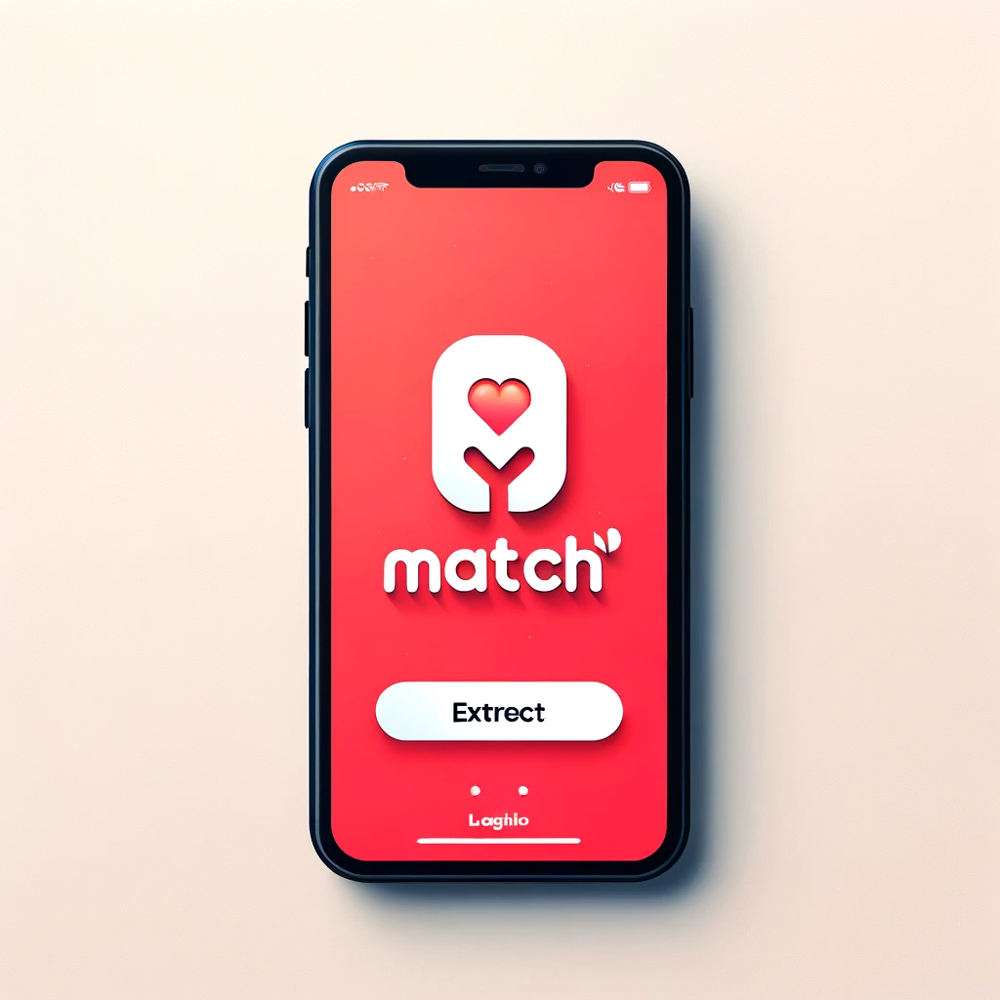

# Match!

## Indice

1. [Descripción](#descripción)
2. [Condiciones de aprobación](#condiciones-de-aprobación)
3. [Requisitos](#requisitos)
    1. [Épicas](#Épicas)
       1. [Usuarios](#usuarios)
       2. [Perfil](#perfil)
       3. [Match Finder](#match-finder)
       4. [Match Plus](#match-plus)
       5. [Mensajes](#mensajes)
       6. [Notificaciones](#Notificaciones)
       7. [Administración de usuarios](#administración-de-usuarios)
       8. [Administración de contenidos](#administración-de-contenidos)
       9. [Administración de servicios](#administración-de-servicios)
       10. [Métricas](#métricas)
    2. [Historias de Usuario](#historias-de-usuario)
4. [Requisitos No Funcionales](#requisitos-no-funcionales)
    1. [Componentes](#componentes)
    2. [Tecnologías](#tecnologias)
    3. [Log](#log)
    4. [Monitoreo](#monitoreo)
    5. [Empaquetamiento](#empaquetamiento)
    6. [Testing](#testing)
    7. [CI-CD](#ci-cd) 
    8. [Despliegue en la Nube](#despliegue-en-la-nube)
    9. [Despliegue usando k8s](#despliegue-usando-k8s)
    10. [UX](#ux)
    11. [Documentación](#documentación)
5. [Instancias de entrega](#instancias-de-entrega)
6. [Historias requeridas y optativas](#historias-requeridas-y-optativas)
    1. [Requeridas](#requeridas)
    2. [Optativas](#optativas)
7. [Material de referencia](#material-de-referencia)

## Descripción

Hemos sido encargados por una empresa destacada para desarrollar una aplicación similar a Tinder llamada **Match**. Esta plataforma digital permitirá a los usuarios conocer gente nueva, ver sus perfiles, indicar si les gusta o no y comunicarse con la misma.

## Condiciones de aprobación

Cada historia de usuario tiene asociada una cierta cantidad de puntos, además, algunas son consideradas obligatorias y otras opcionales.
Para considerar aprobado el trabajo, se requiere cumplir una cierta cantidad de puntos asociados a las historias de usuario. 
Esta cantidad de puntos asociados está compuesto por los puntos provenientes de historias de usuario obligatorias y luego cada grupo deberá escoger entre las historias opcionales para llegar a cumplir con la cantidad de puntos.

Por ejemplo:
- Se requieren 100 puntos provenientes de historias de usuario para aprobar el trabajo.
- Existen 70 puntos que provienen de historias de usuario obligatorias. Entonces todo grupo deberá cumplir con estas historias.
- Los 30 puntos restantes deberán provenir de historias optativas donde el grupo decidirá cuales implementar para llegar a tal número.

## Requisitos

A continuación se describirán una serie de Épicas e Historias de usuario indicando la funcionalidad a cumplir por la plataforma. 

_En caso de que se observe alguna definición ambigua o la falta de la misma, esta debe ser aclarada y definida por el grupo junto a su corrector_ 

### Épicas

<!-- Registro y login -->

#### Usuarios
Como usuario quiero poder registrarme y tener una cuenta para poder acceder a los servicios de la plataforma.

Historias de usuario relacionadas:
 - [Registro](#registro-de-usuarios)
 - [Login con email y contraseña](#login-de-usuarios-con-usuario-y-contraseña)
 - [Login con datos biométricos](#login-con-datos-biométricos)
 - [Login con proveedor de identidad federada](#login-de-usuarios-con-proveedores-de-identidad-federada)
 - [Recupero de contraseña](#recupero-de-contraseña)
 - [Registro Administradores](#registro-de-administradores)
 - [Login Administradores](#login-de-administradores)
 - [Notificación de PIN en proceso de registro](#notificación-de-pin-en-proceso-de-registro)

<!-- Perfil -->

#### Perfil

Como usuario quiero poder editar mi perfil y acceder tanto a mi perfil como al de otros usuarios para conocer y que me conozcan otros usuarios.

Historias de usuario relacionadas:
 - [Edición de perfil](#edición-de-perfil)
 - [Visualizacion de perfil propio](#visualización-de-perfil-propio)
 - [Visualizacion de perfil de otros usuarios](#visualización-de-perfil-de-otros-usuarios)
 - [Obtencion de imagenes de redes sociales](#obtencion-de-imagenes-de-redes-sociales)(Opcional) 
 - [Agregar videos al perfil](#agregar-videos-al-perfil) (Opcional)

<!-- Match Finder -->

#### Match Finder

Como usuario, quiero ser capaz de visualizar una lista de perfiles sugeridos y poder darles like y dislike.

Historias de usuario relacionadas:
 - [Feed](#feed)
 - [Like](#like)
 - [Visualizacion de perfil](#visualizacion-de-perfil)
 - [Match](#match)
 - [List de matches](#lista-de-match)
 - [Bloqueo de match](#bloqueo-de-match)
 - [Filtros de búsqueda](#filtros-de-búsqueda)

<!-- Match Plus -->

#### Match Plus

Como usuario de Match Plus, quiero tener acceso a funciones premium que mejoren mi experiencia y aumenten mis posibilidades de conseguir un match.

Historias de usuario relacionadas:
 - [Likes ilimitados](#likes-ilimitados)
 - [Super Likes](#super-likes)
 - [Rewind](#rewind)
 - [Ver a quién le gustas](#ver-a-quién-le-gustas)
 - [Prioridad en el Feed](#prioridad-en-el-feed)

<!-- Mensajes -->

#### Mensajes

Ofrece una función de mensajería privada para que los usuarios puedan comunicarse de forma directa con otros usuarios.
 
Historias de usuario relacionadas:
 - [Mensajes privados](#mensajes-privados)
 - [Enviar Audio](#enviar-audio)
 - [Enviar Imagen](#enviar-imagen)
 
 
<!-- Notificaciones-->

#### Notificaciones

Como usuario quiero recibir notificaciones al dispositivo que utilizo para informarme sobre actividades en la plataforma

Historias de usuario relacionadas:
 - [Notificación por nuevo mensaje](#notificación-por-nuevo-mensaje)
 - [Notificación por nuevo like](#notificación-por-nuevo-like)
 - [Notificación por nuevo match](#notificación-por-nuevo-match) 

<!-- Administración de usuarios TODO -->

#### Administración de usuarios

Como administrador del sistema quiero poder gestionar los usuarios que están registrados en el mismo para administrar su uso

Historias de usuario relacionadas:
 - [Listar usuarios del sistema](#listar-usuarios-del-sistema)
 - [Visualizar perfil de usuario](#visualizar-perfil-de-usuario)
 - [Bloquear usuario](#bloquear-usuario)

<!-- Administración de contenido TODO -->

#### Administración de contenido

Como administrador del sistema quiero poder gestionar el contenido que se encuentran en el mismo para administrar su uso

Historias de usuario relacionadas:
 - [Listado de Matches](#listado-de-matches)
 - [Visualización de Matches](#visualización-de-matches)
 - [Bloqueo de Matches](#bloquear-matches)

<!-- Administración de servicios -->

#### Administración de servicios

Como administrador del sistema quiero poder gestionar los servicios que se encuentran en el mismo para administrar su uso

Historias de usuario relacionadas:
 - [Listado de servicios](#listado-de-servicios)
 - [Visualización de servicio](#visualización-de-servicio)
 - [Alta de servicio](#alta-de-servicio)
 - [Bloqueo de servicio](#bloquear-de-servicio)

<!-- Metricas  -->

#### Métricas

Como administrador del sistema quiero poder visualizar métricas e información de la plataforma para evaluar el estado del negocio

Historias de usuario relacionadas:
- [Métricas de usuarios](#métricas-de-usuarios)
- [Métricas de contenido](#métricas-de-contenido)

___

### Historias de Usuario

<!-- Registro y login -->
___

#### Registro de usuarios

**Descripción**

- Como usuario no registrado quiero registrarme en la plataforma para acceder a las funcionalidades del sistema. 

_En el resto de los CA se utilizará la nomenclatura Usuario como un usuario registrado_

**Criterios de aceptación**

- CA 1: Registro exitoso
  - Cuando el registro del usuario es correcto.
  - Entonces el sistema creará un nuevo usuario con su perfil. Luego permitirá el ingreso al sistema.
- CA 2: Obtención de ubicación
  - Cuando el registro del usuario es correcto.
  - Entonces el sistema deberá solicitarle al usuario una ubicación predeterminada
- CA 3: Obtención de perfil
  - Cuando el registro del usuario es correcto.
  - Entonces el sistema deberá solicitarle al usuario cuales son sus intereses. 
- CA 4: Obtención de fotos
  - Cuando el registro del usuario es correcto.
  - Entonces el sistema debera solicitar al usuario al menos 3 fotos para utilizar en el perfil
  - El usuario debera indicar su foto principal de perfil
- CA 5: Biografia
  - Cuando el registro del usuario es correcto.
  - Entonces el sistema debera solicitar al usuario una descripcion de si mismo para mostrar
- CA 4: Falta uno o más campos obligatorios
  - Cuando el registro del usuario es incorrecto debido a un ingreso erróneo o faltante de campos. 
  - Entonces el sistema indicará los campos faltantes y/o erróneos y no permitirá el ingreso al sistema.
- CA 5: Registro fallido
  - Cuando el registro del usuario falla debido a un error del servicio.
  - Entonces el sistema indicará un mensaje de error acorde al usuario.

#### Notificación de PIN en proceso de registro

**Descripción**
- Como usuario quiero poder recibir una notificación con un código de seguridad, para confirmar mi registración. Pudiendo optar entre alguno de estos CA

**Criterios de aceptación**
- CA 1: Notificación whatsapp:
  - Cuando un usuario se registra de manera exitosa en la plataforma
  - Entonces deberá  recibir un mensaje de whatsapp con un PIN generado por la plataforma, para confirmar la registración 
- CA 2: Notificación Email:
  - Cuando un usuario se registra de manera exitosa en la plataforma
  - Entonces deberá  recibir un correo electronico con un PIN generado por la plataforma, para confirmar la registración 

___

#### Login de usuarios con usuario y contraseña

**Descripción**

- Como Usuario quiero ingresar a mi cuenta en la plataforma utilizando usuario y contraseña para acceder a las funcionalidades del sistema

**Criterios de aceptación**

- CA 1: Login exitoso con correo electrónico y contraseña
  - Cuando el login del usuario utilizando correo electrónico y contraseña es correcto
  - Entonces el sistema permitirá el ingreso al sistema
  - En caso contrario se deberá mostrar un mensaje de error acorde al usuario.
- CA 2: Login fallido
  - Cuando el login del usuario falla debido a un error del servicio.
  - Entonces el sistema indicará un mensaje de error acorde al usuario.
- CA 3: Sesión expirada
  - Cuando la sesión del usuario excede el tiempo de expiración
  - Entonces el sistema solicitará al usuario nuevamente el login
- CA 4: Usuario bloqueado
  - Cuando la cuenta del usuario se encuentra bloqueada por los administradores
  - Entonces el sistema no le permitirá loguearse al usuario
___

#### Login de usuarios con proveedores de identidad federada

**Descripción**

- Como Usuario quiero ingresar con mi cuenta en la plataforma con proveedores de identidad federada para acceder a las funcionalidades del sistema

**Criterios de aceptación**

- CA 1: Login exitoso con proveedores de identidad federada
  - Cuando el login del usuario utilizando proveedores de identidad federada es correcto
  - Entonces el sistema permitirá el ingreso al sistema
  - En caso contrario se deberá mostrar un mensaje de error acorde al usuario.
- CA 2: Login fallido
  - Cuando el login del usuario falla debido a un error del servicio.
  - Entonces el sistema indicará un mensaje de error acorde al usuario.
- CA 3: Sesión expirada
  - Cuando la sesión del usuario excede el tiempo de expiración
  - Entonces el sistema solicitará al usuario nuevamente el login
- CA 4: Usuario bloqueado
  - Cuando la cuenta del usuario se encuentra bloqueada por los administradores
  - Entonces el sistema no le permitirá loguearse al usuario
___

#### Login con datos biométricos

**Descripción**

- Como Usuario quiero ingresar con mi cuenta en la plataforma utilizando mis datos biométricos

**Criterios de aceptación**

- CA 1: Login exitoso con datos biométricos
  - Cuando el login del usuario utilizando datos biométricos, tales como identificación por rostro o huella dactilar, es correcto
  - Entonces el sistema permitirá el ingreso al sistema
  - En caso contrario se deberá mostrar un mensaje de error acorde al usuario.
- CA 2: Login fallido
  - Cuando el login del usuario falla debido a un error del servicio.
  - Entonces el sistema indicará un mensaje de error acorde al usuario.
- CA 3: Sesión expirada
  - Cuando la sesión del usuario excede el tiempo de expiración
  - Entonces el sistema solicitará al usuario nuevamente el login
- CA 4: Usuario bloqueado
  - Cuando la cuenta del usuario se encuentra bloqueada por los administradores
  - Entonces el sistema no le permitirá loguearse al usuario

___

#### Recupero de contraseña

**Descripción**

- Como Usuario quiero poder recuperar mi contraseña en caso de que no la recuerde

**Criterios de aceptación**
- CA 1: Recupero de contraseña exitoso
  - Cuando se realice un recupero de contraseña
  - Entonces se deberá enviar un email con un link de recupero de contraseña, el cual tiene solo un uso y un tiempo de expiración

___

#### Registro de administradores

**Descripción**

- Como administrador quiero poder dar de alta a otros administradores en la plataforma para acceder a las funcion

**Criterios de aceptación**

- CA 1: Registro exitoso
  - Cuando el registro del administrador es correcto.
  - Entonces el sistema registrará un nuevo administrador con sus respectivas credenciales y permitirá el ingreso al sistema.
- CA 2: Falta uno o más campos obligatorios
  - Cuando el registro del administrador es incorrecto debido a un ingreso erróneo o faltante de campos. 
  - Entonces el sistema indicará los campos faltantes y/o erróneos y no permitirá el ingreso al sistema
- CA 3: Registro fallido
  - Cuando el registro del administrador falla debido a un error del servicio.
  - Entonces el sistema indicará un mensaje de error acorde al usuario.

___

#### Login de administradores

**Descripción**

- Como Administrador quiero ingresar con mi cuenta en la plataforma para acceder a las funcionalidades del sistema

**Criterios de aceptación**

- CA 1: Login exitoso 
  - Cuando el login del administrador utilizando sus credenciales es correcto
  - Entonces el sistema permitirá el ingreso al sistema
  - En caso contrario se deberá mostrar un mensaje de error acorde al usuario.
- CA 2: Login fallido
  - Cuando el login del usuario falla debido a un error del servicio.
  - Entonces el sistema indicará un mensaje de error acorde al usuario.

<!-- Perfil -->
___

#### Edición de perfil

**Descripción**

- Como Usuario quiero poder editar los datos de mi perfil de usuario para mantener actualizada mi información personal.

**Criterios de aceptación**

- CA 1: Edición de datos de perfil exitosa
  - Cuando se modifican los datos de la cuenta del Usuario de manera exitosa
  - Entonces estos nuevos datos serán los que se utilicen como datos de perfil de usuario
  - En caso contrario se deberá mostrar un mensaje de error acorde al usuario.
- CA 2: Ordenamiento de fotos
  - Cuando el usuario esta en la pantalla de edicion de perfil,
  - Entonces debera poder sumar, quitar y ordenar las fotos para elegir en que orden y cuales se muestran

___

#### Visualizacion de perfil propio

**Descripción**

- Como Usuario quiero poder visualizar los datos de mi perfil de usuario para revisar mi información

**Criterios de aceptación**

- CA 1: Visualización de perfil propio
  - Cuando se visualice el perfil del usuario propietario de la cuenta.
  - Entonces estos se visualizarán datos públicos y privados del usuario.
  - En caso contrario se deberá mostrar un mensaje de error acorde al usuario.

___

#### Visualizacion de perfil de otros usuarios

**Descripción**

- Como Usuario quiero poder visualizar los datos de los otros usuarios para conocer su información de contacto

**Criterios de aceptación**

- CA 1: Visualización de perfil de otros usuarios
  - Cuando se visualice el perfil de un usuario que no es propietario de la cuenta
  - Entonces estos se visualizarán datos públicos del usuario

___

#### Obtencion de imagenes de redes sociales (Opcional)

**Descripción**

- Como Usuario quiero poder utilizar fotos de mis redes sociales para mi perfil

**Criterios de aceptación**

- CA 1: Obtencion de imagenes
    - Cuando estoy en la vista de edicion de perfil
    - Entonces debo ser capaz de vincular mi cuenta con Facebook o Instagram
    - Debo poder elegir fotos para vincular con mi perfil
___

#### Agregar videos al perfil (Opcional)

**Descripción**
- Como usuario, quiero poder agregar videos cortos a mi perfil que se reproduzcan automáticamente en bucle, para mostrar dinámicamente mi personalidad y mis intereses.

**Criterios de aceptación**

- CA 1: Subida de video corto
  - Cuando estoy en la sección de edición de mi perfil,
  - Entonces quiero poder subir videos cortos, con una duración máxima de 7 segundos, y el sistema debe verificar que no superen esta duración ni un tamaño máximo establecido.

- CA 2: Reproducción automática en bucle
  - Una vez que un video ha sido agregado al perfil,
  - Entonces este se debe reproducir automáticamente en bucle cuando esté en el foco de la visualización en mi perfil o en el feed de otros usuarios.

- CA 3: Restricciones de contenido
  - Al subir un video, debe pasar por un chequeo automático para asegurar que cumple con las normas de la comunidad y no contiene contenido inapropiado.

<!-- Match finder -->

___

#### Feed

**Descripción**

- Como usuario (regular o de Match Plus), quiero ser capaz de ver una lista de perfiles sugeridos en formato de stack de perfiles. Debo poder avanzar al siguiente perfil en función de mi reacción (like o dislike) y visualizar los perfiles en detalle.

**Criterios de aceptación**

- CA 1: Visualización del Feed:
  - Cuando inicio sesión en mi cuenta de Match,
  - Entonces se debe mostrar un feed en la página principal.
  - El feed debe presentar un stack de perfiles que aún no haya visto y puedan ser de mi interes.

- CA 2: Avanzar al siguiente perfil:
  - Cuando veo el feed,
  - Entonces puedo ver el proximo perfil solo si doy like o dislike al mismo

- CA 3: Visualizacion de perfil:
  - Cuando estoy viendo el feed,
  - Entonces puedo tocar la foto de perfil del usuario y entrar a ver el perfil de la persona de mi interes

- CA 4: Restricciones de likes para usuarios regulares:
  - Como usuario regular, debo tener un límite de likes que puedo dar en un día.
  - Cuando alcanzo el límite de likes,
  - Entonces se debe notificar que he alcanzado el límite y no puedo dar más likes hasta el próximo día.

- CA 5: Likes ilimitados para usuarios de Match Plus:
  - Como usuario de Match Plus,
  - Entonces puedo dar likes de forma ilimitada, sin encontrar restricciones diarias.

___

#### Like

**Descripción**

- Como usuario de Match, quiero poder dar like o dislike a los perfiles que se me presentan. Se entiende por like el indicar que un perfil me interesa y dislike que un perfil no me interesa

**Criterios de aceptación**

- CA 1: Like
  - El sistema debe permitir que al marcar un indicador de like, se guarde mi interes por el perfil en cuestion.
  
- CA 2: Dislike
  - El sistema debe permitir que al marcar un indicador de dislike, se guarde que no me interesa seguir viendo el perfil.

- CA 3: Restricción de likes diarios para usuarios regulares
  - Como usuario regular, debo tener un número limitado de likes que puedo dar cada día.
  - Si intento dar like después de alcanzar mi límite diario,
  - Entonces el sistema debe notificar que he alcanzado mi límite diario de likes y no puedo dar más likes hasta el siguiente día.

___

#### Visualizacion de perfil

**Descripción**

- Como usuario de Match, quiero poder acceder a los perfiles que me son mostrados, al momento en que me son mostrados.

**Criterios de aceptación**

- CA 1: Visualización de perfil
  - Cuando toco una foto de perfil
  - Entonces debo poder acceder al perfil de una persona.

___

#### Match

**Descripcion**

- Cuando se producen likes cruzados, se considera que se produjo un match y los usuario deben ser capaces de contactarse el uno con el otro

**Criterios de aceptación**

- CA 1: Notificacion del match
  - Cuando se produce un match
  - Entonces el usuario debe ser notificado del mismo

___

#### Lista de matches

**Descripcion**

- Como usuario de Match, quiero ser capaz de ver una lista de los perfiles con los que tuve un match

**Criterios de aceptacion**

- CA 1: Listado de matches
  - Cuando ingreso a la aplicacion
  - Entonces tengo acceso a una vista de usuarios con los que hice match
  - Se listan en orden cronologico o de ultimo chat

- CA 2: Ver perfil
  - Cuanto estoy en la lista de matches
  - Entonces puedo ingresar al perfil de las personas con las que hice match

- CA 3: Chatear
  - Cuando estoy en la lista de matches
  - Entonces puedo ingresar al chat con las personas con las que tengo match

- CA 4: Listado vacio
  - Cuando ingreso a la lista de matches y no tengo ningun match aun
  - Entonces se muestra un mensaje indicando que no hay matches
  - El mensaje ofrece ir a la vista principal para intentar conseguir matches

___

#### Bloqueo de match

**Descripcion**

- Como usuario de Match, quiero ser capaz de dar de baja los matches con los cuales no quiero seguir en contacto

**Criterios de aceptacion**

- CA 1: Bloqueo de usuario
  - Cuando estoy en la lista de matches
  - Entonces quiero tener la opcion de bloquear a un usuario con el que hice match
  - El perfil debe desaparecer de mi lista de matches, asi como el historial de chats
  - El otro usuario tampoco debera poder ver mi perfil de nuevo ni mis chats

- CA 2: Validacion de bloqueo
  - Cuando elijo bloquear un usuario,
  - Entonces el sistema debe validar mi pedido
___

#### Filtros de búsqueda

**Descripción**
- Como usuario, quiero poder aplicar filtros en la búsqueda de perfiles para encontrar personas que coincidan con mis intereses y preferencias.

**Criterios de aceptación**

- CA 1: Filtrado por sexo
  - Los usuarios deben poder filtrar los perfiles sugeridos basándose en el sexo.

- CA 2: Filtrado por rango etario
  - Los usuarios deben poder establecer un rango de edad para los perfiles sugeridos.

- CA 3: Filtrado por cercanía
  - Los usuarios deben poder establecer un rango de distancia para los perfiles sugeridos, para encontrar personas cercanas a su ubicación actual.

- CA 4: Opciones de filtrado adicionales
  - Se deben ofrecer opciones adicionales de filtrado, como intereses específicos, actividades, nivel de educación, etc., para refinar aún más la búsqueda de perfiles.

- CA 5: Guardar preferencias de filtrado
  - Los usuarios deben poder guardar sus configuraciones de filtro para futuras búsquedas, agilizando el proceso de encontrar perfiles de interés.

<!-- Match Finder -->
___

#### Likes ilimitados

**Descripción**

- Como usuario de Match Plus, quiero poder dar likes de forma ilimitada para no tener restricciones al mostrar interés en otros perfiles.

**Criterios de aceptación**

- CA 1: Likes sin restricción
  - Cuando un usuario de Match Plus navega en el feed.
  - Entonces debe poder dar likes de manera ilimitada sin encontrarse con límites diarios.

___

#### Super Likes

**Descripción**

- Como usuario de Match Plus, quiero tener la opción de dar Super Likes, los cuales indican un interés mayor que un like regular.

**Criterios de aceptación**

- CA 1: Disponibilidad de Super Likes
  - Cuando un usuario de Match Plus navega en el feed.
  - Entonces debe tener la opción de dar Super Likes a perfiles que le interesen especialmente, destacando su perfil a los usuarios Super Liked.

- CA 2: Notificación de Super Like
  - Cuando un usuario recibe un Super Like.
  - Entonces debe recibir una notificación específica, indicando quién le dio el Super Like.

- CA 3: Limitación diaria de Super Likes
  - Aunque los likes son ilimitados, los Super Likes deben tener un límite diario.
  - Cuando un usuario de Match Plus alcanza el límite de Super Likes por día.
  - Entonces se le debe notificar que ya no puede dar más Super Likes hasta el día siguiente.

___

#### Rewind

**Descripción**

- Como usuario de Match Plus, quiero poder deshacer mi último swipe (like o dislike) en caso de que haya sido accidental.

**Criterios de aceptación**

- CA 1: Deshacer swipe
  - Cuando un usuario de Match Plus realiza un swipe.
  - Entonces debe tener la opción de deshacer la última acción de swipe realizada.
___

#### Ver a quién le gustas

**Descripción**

- Como usuario de Match Plus, quiero poder ver los perfiles de usuarios a quienes les he gustado antes de decidir si les doy like o no.

**Criterios de aceptación**

- CA 1: Listado de interesados
  - Cuando un usuario de Match Plus accede a la sección correspondiente.
  - Entonces debe poder ver una lista de usuarios a quienes les ha gustado su perfil, permitiéndole decidir si desea hacer match con ellos.

- CA 2: Interacción con perfiles interesados
  - Cuando un usuario de Match Plus visualiza los perfiles que le han dado like.
  - Entonces puede interactuar directamente con estos perfiles, pudiendo dar like o dislike.

- CA 3: Actualización en tiempo real (Opcional)
  - La lista de usuarios a quienes les gustas debe actualizarse en tiempo real.
  - Cuando un nuevo usuario da like al perfil de un usuario de Match Plus.
  - Entonces este último debe ver al nuevo usuario en su lista de "A quién le gustas" de forma inmediata.

___

#### Prioridad en el Feed

**Descripción**

- Como usuario de Match Plus, quiero que mi perfil tenga prioridad en el feed de otros usuarios para aumentar mis posibilidades de conseguir matches.

**Criterios de aceptación**

- CA 1: Prioridad en visualización
  - Cuando un usuario de Match Plus es parte del feed de otros usuarios.
  - Entonces su perfil debe aparecer con mayor prioridad respecto a usuarios no Plus, incrementando así sus chances de ser visto y recibir likes.

<!-- Messages-->
___

#### Mensajes privados
- Como usuario quiero poder enviar mensajes privados a mis matches

**Criterios de aceptación**

- CA 1: Mensaje directo
  - Cuando hice match con otra persona
  - Entonces quiero poder acceder a un chat con la persona en cuestion
___

#### Enviar Audio (Opcional)

**Descripción**
- Como usuario, quiero poder enviar mensajes de audio a mis matches para enriquecer la comunicación.

**Criterios de aceptación**

- CA 1: Grabación de audio
  - Cuando estoy en un chat con un match,
  - Entonces quiero poder grabar un mensaje de audio directamente en la aplicación.

- CA 2: Envío de audio
  - Después de grabar un mensaje de audio,
  - Entonces quiero enviarlo directamente a mi match desde el chat.

- CA 3: Reproducción de audio
  - Cuando recibo un mensaje de audio,
  - Entonces quiero poder reproducir el audio dentro de la conversación del chat.
___

#### Enviar Imagen (Opcional)

**Descripción**
- Como usuario, quiero poder enviar imágenes a mis matches para compartir momentos o información visual.

**Criterios de aceptación**

- CA 1: Selección de imagen
  - Cuando estoy en un chat con un match,
  - Entonces quiero poder seleccionar una imagen de mi dispositivo para enviarla.

- CA 2: Envío de imagen
  - Después de seleccionar una imagen,
  - Entonces quiero enviarla directamente a mi match desde el chat.

- CA 3: Visualización de imagen
  - Cuando recibo una imagen,
  - Entonces quiero poder ver la imagen dentro de la conversación del chat.

 <!-- Notificaciones -->

___

#### Notificación por nuevo mensaje

**Descripción**
- Como usuario quiero poder recibir una notificación en caso de recibir un nuevo mensaje

**Criterios de aceptación**
- CA 1: Pantalla de notificaciones
  - Cuando un usuario recibe un mensaje directo
  - Entonces deberá poder visualizar una notificación en la aplicación para acceder a dicho mensaje 
- CA 2: Notificación push.
  - Cuando un usuario recibe un mensaje directo
  - Entonces deberá recibir notificación push en la aplicación para acceder a dicho mensaje

___

#### Notificación por nuevo like

**Descripción**
- Como usuario, quiero recibir notificaciones cuando alguien me da un like para poder estar informado sobre quién muestra interés en mi perfil.

**Criterios de aceptación**

- CA 1: Notificación para usuarios regulares
  - Cuando un usuario regular recibe un like,
  - Entonces el sistema deberá enviar una notificación que indique que "Alguien te dio like".

- CA 2: Notificación para usuarios premium
  - Cuando un usuario premium recibe un like,
  - Entonces el sistema deberá enviar una notificación mostrando el nombre del usuario que dio like.

- CA 3: Acceso a perfil desde la notificación para usuarios premium
  - Cuando un usuario premium recibe una notificación de like,
  - Entonces debe poder acceder directamente al perfil del usuario que le dio like desde la notificación.

- CA 5: Visualización diferenciada en la pantalla de notificaciones
  - Como usuario regular, cuando recibo likes,
    - Entonces deberá poder visualizar en la pantalla de notificaciones un resumen que muestre el número de nuevos likes recibidos, sin detalles específicos de quiénes son.
  - Como usuario premium, cuando recibo likes,
    - Entonces deberá poder visualizar en la pantalla de notificaciones una lista detallada de los usuarios que me han dado like, con la opción de ver sus perfiles y decidir si quiero darles like de vuelta.
___

#### Notificación por nuevo match

**Descripción**
- Como usuario, quiero recibir notificaciones cuando un consigo un nuevo match

**Criterios de aceptación**

- CA 1: Notificación por nuevo match
    - Cuando consigo un nuevo match,
    - Entonces el sistema deberá enviar una notificación al usuario para informarle sobre esto.

- CA 2: Acceso a nuevo match
    - Cuando recibo una notificación sobre un nuevo match,
    - Entonces debo poder acceder directamente al perfil en cuestión desde la notificación.

- CA 3: Notificación Visual en la Aplicación
    - Cuando consigo un nuevo match,
    - Entonces el usuario deberá poder ver una notificación visual en la aplicación que indique sobre esto.

- CA 4: Notificación Push de nuevo match
    - Cuando consigo un nuevo match,
    - Entonces el usuario deberá recibir una notificación push en la aplicación para informarle sobre esto.

- CA 5: Pantalla de notificaciones
  - Cuando recibo una notificación sobre un nuevo match,
  - Entonces deberá poder visualizar una notificación en la aplicación para acceder a dicho contenido 

- CA 6: Notificación Whatsapp de nuevo Match (Opcional)
    - Cuando consigo un nuevo match,
    - Entonces el usuario deberá recibir una notificación a su Whatsapp para informarle sobre esto.

- CA 7: Visualizacion de perfil desde la notificacion
    - Cuando consigo un nuevo match y recibo la notificacion,
    - Entonces el usuario puede hacer tap en la misma y ser dirigido al perfil de la persona con la que hizo match

___

#### Notificación por mensaje del sistema (opcional)

**Descripción**
- Como usuario, quiero poder recibir notificaciones del sistema para invitarme a usar la aplicacion .

**Criterios de aceptación**

- CA 1: Notificación del sistema
    - Cuando el sistema lo defina,
    - Entonces el sistema puede enviar una notificacion al usuario invitandolo a usar la aplicacion.

___

<!-- Administración de usuarios -->

___

#### Listar usuarios del sistema

**Descripción**
- Como administrador del sistema quiero poder listar todos los usuario del sistema para gestionar su uso

**Criterios de aceptación**
- CA 1: Listado de usuarios del sistema
  - Cuando un administrador del sistema ingrese a la sección de usuarios
  - Entonces se listaran todos los usuarios del sistema.

___

#### Visualizar perfil de usuario

**Descripción**
- Como administrador del sistema quiero poder visualizar el perfil de un  usuario del sistema para verificar sus datos

**Criterios de aceptación**
- CA 1: Listado de usuarios del sistema
  - Cuando un administrador del sistema ingrese a la sección de usuarios
  - Entonces se listaran todos los usuarios del sistema.

___

#### Bloquear usuario

**Descripción**
- Como administrador del sistema quiero poder bloquear y desbloquear un  usuario del sistema para controlar su ingreso a la plataforma

**Criterios de aceptación**
- CA 1: Bloqueo exitoso
 - Cuando un administrador bloquea a un usuario.
 - Entonces se deberá visualizar que el usuario esta bloqueado y el usuario no deberá poder acceder a la plataforma
 - CA 2: Desbloqueo exitoso
 - Cuando un administrador desbloquea a un usuario.
 - Entonces se deberá visualizar que el usuario no esta bloqueado y el usuario deberá poder acceder a la plataforma

<!-- Administración de contenidos -->

___

#### Listado de Matches

**Descripción**
- Como administrador del sistema quiero poder listar todos matches que se encuentren en el sistema para acceder a ellos 

**Criterios de aceptación**
- CA 1: Listado con Matches existentes
 - Cuando un administrador solicita visualizar el listado de Matches en la plataforma
 - Entonces se deberán listar todos los Matches existentes en el sistema
- CA 2: Listado con Matches existentes utilizando filtros
 - Cuando un administrador solicita visualizar el listado de Matches en la plataforma y aplica un filtrado 
 - Entonces se deberán listar todos los Matches existentes en el sistema que cumplan con dichos filtros

___

#### Visualización de Matches

**Descripción**
- Como administrador del sistema quiero poder visualizar un Matches para ver informacion de los usuarios. 

**Criterios de aceptación**
- CA 1: Visualización de Matches
 - Cuando un administrador visualiza el Matches existente en la plataforma
 - Entonces se deberá poder visualizar todos sus datos asociados

___

#### Bloqueo de Matches

**Descripción**
- Como administrador del sistema quiero poder bloquear un Matches que se encuentren en el sistema para que no puedan acceder al mismo

**Criterios de aceptación**
- CA 1: Bloqueo exitoso 
 - Cuando un administrador realiza el bloqueo de un Matches existente en la plataforma
 - Entonces se deberá visualizar que el Matches está bloqueado y los usuarios no deberán poder acceder a él en la aplicación, ni a los chats relacionados
- CA 2: Desbloqueo exitoso 
 - Cuando un administrador realiza el desbloqueo de un Matches existente en la plataforma
 - Entonces se deberá visualizar que el Matches no esta bloqueado y los usuarios deberán poder acceder a el en la aplicación
 

 
 

<!-- Administración de servicios -->
___

#### Listado de servicios

**Descripción**
- Como administrador del sistema quiero poder listar todos los servicios que se encuentren dentro del sistema para controlar su uso

**Criterios de aceptación**
- CA 1: Listado de servicios
 - Cuando un administrador solicita visualizar el listado de servicios en la plataforma
 - Entonces se deberán listar todos los servicios existentes en el sistema
- CA 2: Listado de servicios existentes utilizando filtros
 - Cuando un administrador solicita visualizar el listado de servicios en la plataforma y aplica un filtrado 
 - Entonces se deberán listar todos los servicios existentes en el sistema que cumplan con dichos filtros

___

#### Visualización de servicio

**Descripción**
- Como administrador del sistema quiero visualizar la información de un servicio que se encuentre en el sistema para verificar que sea válida

**Criterios de aceptación**
- CA 1: Visualización de información de un servicio
 - Cuando un administrador ingresa a visualizar la información de un servicio
 - Entonces podrá encontrar datos como:
   - Estado del servicio.
   - Fecha de creación.
   - Descripción.
   - Otros.
___

#### Alta de servicio

**Descripción**
- Dado que existen requisitos de seguridad que solicitan tener un mecanismo para verificar la autenticidad de los servicios internos de la plataforma. Como administrador del sistema quiero poder dar de alta un nuevo servicio para que pueda acceder a los distintos servicios del sistema

**Criterios de aceptación**
- CA 1: Alta de Api Key
 - Cuando un administrador da de alta un nuevo servicio.
 - Entonces se genera un API key que deberá ser utilizada de manera interna en la plataforma para que un servicio pueda comunicarse con sus pares
___

#### Bloqueo de servidor

**Descripción**
- Como administrador del sistema quiero poder bloquear un nuevo servicio para que no pueda acceder a los distintos servicios del sistema

**Criterios de aceptación**
- CA 1: Alta de Api Key
 - Cuando un administrador bloquee un servicio.
 - Entonces se deberá bloquear su API key asociada y tal servicio no podrá comunicarse con sus pares.

<!-- Metricas -->
___

#### Métricas de usuario

**Descripción**
- Como administrador del sistema quiero poder visualizar las métricas de usuarios para medir el uso de la plataforma y sus servicios

**Criterios de aceptación**

- CA 1: Métricas de Nuevos Usuarios utilizando Mail y Contraseña
  - Cuando un nuevo usuario se registra en la plataforma utilizando correo electrónico y contraseña,
  - Entonces se deben registrar y almacenar las métricas relacionadas con el proceso de registro, incluyendo el número total de nuevos usuarios registrados, la tasa de éxito del registro y el tiempo promedio de registro.

- CA 2: Métricas de Nuevos Usuarios utilizando Identidad Federada
  - Cuando un nuevo usuario se registra en la plataforma utilizando un proveedor de identidad federada (por ejemplo, Google, Facebook, etc.),
  - Entonces se deben registrar y almacenar las métricas asociadas al registro a través de identidad federada, incluyendo el número total de nuevos usuarios registrados de esta manera y la distribución de los proveedores de identidad utilizados.

- CA 3: Métricas de Login de Usuarios utilizando Mail y Contraseña
  - Cuando un usuario inicia sesión en la plataforma utilizando su correo electrónico y contraseña,
  - Entonces se deben registrar y almacenar las métricas relacionadas con el proceso de inicio de sesión, como el número de inicios de sesión exitosos, intentos fallidos de inicio de sesión y tiempo promedio de inicio de sesión.

- CA 4: Métricas de Login de Usuarios utilizando Identidad Federada
  - Cuando un usuario inicia sesión en la plataforma utilizando identidad federada,
  - Entonces se deben registrar y almacenar las métricas relacionadas con el inicio de sesión a través de identidad federada, incluyendo el número total de inicios de sesión exitosos utilizando proveedores de identidad federada.

- CA 5: Métricas de Usuarios Bloqueados
  - Cuando un usuario es bloqueado o suspendido en la plataforma debido a violaciones de términos de uso o políticas,
  - Entonces se deben registrar y almacenar las métricas relacionadas con usuarios bloqueados, incluyendo el número total de usuarios bloqueados, las razones para el bloqueo y la duración de los bloqueos.

- CA 6: Métricas de Recupero de Contraseña
  - Cuando un usuario solicita y completa un proceso de recuperación de contraseña,
  - Entonces se deben registrar y almacenar las métricas asociadas al proceso de recuperación de contraseña, incluyendo el número de solicitudes de recuperación, el éxito de las recuperaciones y el tiempo promedio de recuperación.

- CA 7: Métricas de Usuarios por Zona Geográfica
  - Cuando se registra la ubicación geográfica de los usuarios durante el registro o el inicio de sesión,
  - Entonces se deben registrar y almacenar las métricas relacionadas con la distribución geográfica de los usuarios, incluyendo la cantidad de usuarios por zona geográfica, las ubicaciones más comunes y las tendencias de uso en diferentes regiones.

___
#### Métricas de contenido

**Descripción**
- Como administrador del sistema quiero poder visualizar las métricas de contenido para medir el uso de la plataforma y sus servicios

**Criterios de aceptación**

- CA 1: Métricas de nuevo Matches
  - Cuando se produce un match en la plataforma,
  - Entonces se deben registrar y almacenar las métricas relacionadas con el match, incluyendo el número total de nuevos Matches, la frecuencia de los mismos y la relacion likes - matches.

- CA 2: Métricas de conversaciones entabladas
  - Cuando se produce un match en la plataforma,
  - Entonces se deben registrar y almacenar las métricas asociadas a cuantos de los matches derivaron en conversaciones.

- CA 3: Métricas de uso de funcionalidades
  - Se deben medir cuán frecuentemente se utilizan las distintas funcionalidades de la app,
  - Como el envío de mensajes, publicación de nuevos contenidos, uso de la funcionalidad de Rewind y Boost, entre otros.

___

## Requisitos No Funcionales

### Componentes

La plataforma constará de los siguientes componentes:

### Aplicación mobile

Una aplicación mobile, el cual será utilizado por los usuarios.
_Las tecnologías a utilizar son detalladas en la sección [tecnologías](#tecnologias)_

### Backoffice web

Un backoffice web, el cual será utilizado por los administradores. 

_Las tecnologías a utilizar son detalladas en la sección [tecnologías](#tecnologias)_

### Servicios backend

Distintos servicios de backend para brindar soporte a la plataforma. Como enfoque se recomienda orientar estos servicios hacia una arquitectura de [microservices](https://martinfowler.com/articles/microservices.html). Dicha arquitectura propuesta deberá ser convalidada junto al ayudante. 
_Las tecnologías a utilizar son detalladas en la sección [tecnologías](#tecnologias)_

___

### Tecnologias

Stack de tecnologías recomendadas para el desarrollo de los distintos componentes.

#### Aplicación mobile

Para el desarrollo de la App se podrá optar por:
- Desarrollar sobre [React Native](https://reactnative.dev/) utilizando [JavaScript](https://developer.mozilla.org/es/docs/Web/JavaScript) como lenguaje de programación. 
- Desarrollar sobre [Android](https://developer.android.com/) nativo utilizando [Kotlin](https://kotlinlang.org/) como lenguaje de programación.

___

#### Servicios backend

Para el desarrollo de los servicios backend se deberá utilizar como lenguajes de programación:
- [Python](https://www.python.org/)
- [JavaScript](https://developer.mozilla.org/es/docs/Web/JavaScript)
- [Go](https://go.dev/)

Junto con sus respectivos frameworks. La cátedra recomienda alguno de estos
- Python:
  - [FastAPI](https://fastapi.tiangolo.com/)
  - [Flask](https://flask.palletsprojects.com/en/1.1.x/)
  - [Django](https://www.djangoproject.com/)
  - [Tornado](https://www.tornadoweb.org/en/stable/)
  
- JavaScript:
  - [NodeJs](https://nodejs.org/es/)
  - [Express](https://expressjs.com/)
  - [Fastify](https://www.fastify.io/)
  - [Nest.js](https://nestjs.com/)

 - GO:
   - [Gin](https://github.com/gin-gonic/gin)

Se recomiendan como base de datos alguna de las siguientes 
- [PostgreSQL](https://www.postgresql.org/)
- [MongoDB](https://www.mongodb.com/es)

Esta elección será responsabilidad del grupo y la misma deberá estar consensuada junto al ayudante. Además quedará justificada en la documentación técnica que formará parte del TP.
___

#### Backoffice web
Para el desarrollo del backoffice web se podrán utilizar las siguientes herramientas
  - [React](https://reactjs.org/)
  - [Vue.js](https://vuejs.org/)
  - [Next.js](https://nextjs.org/)
___

#### Contenido multimedia
Para el uso de contenido multimedia se recomienda utilizar el servicio provisto por firebase [Storage](https://firebase.google.com/docs/storage?hl=es)

___

#### Chat
Para el uso del chat en tiempo real se recomienda utilizar el servicio provisto por firebase [Real time database](https://firebase.google.com/docs/database?hl=es)

___

#### Notificaciones 

##### Push
Para el uso de notificaciones push se recomienda utilizar el servicio provisto por firebase [Cloud Messaging](https://firebase.google.com/docs/cloud-messaging?hl=es)

##### Mensajeria whatsapp
Para el uso de mensajería con whatsapp se recomienda utilizar el servicio provisto por [Twilio](https://www.twilio.com/quest/github-education)

___

### Log

Los servidores deben contar con un sistema de log en donde se registren los eventos que se generen durante la ejecución. El sistema de log debe permitir configurar el nivel de los eventos que desean registrar. Estos niveles son:

| Nivel | Condiciones |
| ----- | ----------- |
| Error | Condición de falla catastrófica, el sistema no puede funcionar. (criterio de las 2 a.m.) Condición que haga que la aplicación no pueda ejecutar una funcionalidad. Ejemplo: No es posible conectarse con la base de datos |
| Warn | Cualquier condición anómala que afecte el funcionamiento del sistema, pero no impida la funcionalidad básica Ejemplos: Uso de APIs deprecadas, Mal uso de APIs |
| Info | Cualquier acción correspondiente a un caso de uso iniciada por el usuario o el sistema. Información que permita trazar el historial de las entidades. Ejemplos: Conexión a la base de datos exitosa, Conexión de nuevo cliente |
| Debug | Información de contexto que permita resolver un problema técnico. Debe ser útil incluso sin el código fuente Ejemplo:  Datos de login para la DB |

Estos logs deberán ser almacenados de tal manera que puedan ser accedidos en cualquier momento

### Monitoreo

Para el monitoreo de los servicios se recomiendan alguna de las siguientes librerías/plataformas

- [Datadog](https://www.datadoghq.com/blog/datadog-github-student-developer-pack/)
- [New Relic](https://blog.newrelic.com/product-news/simple-pricing/)
- [Prometheus](https://prometheus.io/)
- [Grafana](https://grafana.com/)

### Empaquetamiento

Cada uno de los desarrollos solicitados debe empaquetarse según el estándar de la plataforma, es decir:

* _Python_: Python Setuptools (`setup.py` y `requeriments.txt`)
* _Node_: Node Package Manager (`npm`, `package.json`), Yarn Package Manager(https://yarnpkg.com/lang/en/)
* _Android Client_: Android Application Package (`apk`)

Además, los proyectos backend deberán traer un `Dockerfile` que permita correrlos sin necesidad de tener instalado los respectivos lenguajes.

### Testing

El desarrollo de la aplicación se deberá adaptar a los estándares de calidad utilizados por AppMaker©. Dentro de estos estándares se encuentran:

* Pruebas unitarias
* Métricas: code coverage debe ser mayor a 75%
* Respetar estándar para estilo de codificación: Lint
* Pruebas de integración.
* Todas aquellas que se consideren convenientes para garantizar la calidad de las aplicaciones desarrolladas.
 
**Nota:** Esta sección hace sólo referencia a los servicios de backend No se toma como requerimiento el realizar pruebas sobre el cliente Android, aunque es recomendado como una buena práctica.

### CI-CD

Las pruebas y métricas anteriormente mencionadas deberán correr bajo una plataforma de integración continua. 

Se sugiere el uso de [GitHub Actions](https://github.com/features/actions) o [Gitlab Pipelines](https://docs.gitlab.com/ee/ci/pipelines/), pero se podrá utilizar otro previa justificación.

El resultado del _code coverage_ debe ser desplegado automáticamente a una plataforma que permita visualizarlas, entre muchas posibilidades se encuentran:

* [Coveralls](https://coveralls.io/)
* [Codecov](https://codecov.io/)
* Utilizar [Github Pages](https://pages.github.com/) para generar una web para visualizarlo

Finalmente, el despliegue al servidor de _PAAS_ elegido deberá ser automático. Este deberá tener en cuenta como la actualización de la base de datos (cambios en las tablas, etc). El mecanismo utilizado para disparar dicho despliegue (utilizar el branch _master_ como productivo, utilizar un tags con nombre especial) será definido por los desarrolladores y deberá ser detallado en la documentación

### Despliegue en la Nube

Los servicios, se deberán disponibilizar en la nube utilizando una plataforma como servicio (_[PAAS](https://en.wikipedia.org/wiki/Platform_as_a_service)_).
La catedra recomienda leer la sección <<COMPLETAR>> del sitio de la materia para informarse las distintas opciones disponibles
 

___

### Despliegue usando k8s

De manera optativa se podrá realizar una migración de los servicios backend de la plataforma a kubernetes

### UX

Se deberá presentar evidencia de prototipado del diseño de pantallas, las cuales serán convalidadas junto al ayudante a cargo

Para el diseño de la interfaz deben respetarse las guías de diseño propuestas por Google con _[Material Design](https://material.io/design/)_.

### Documentación

Se deberá entregar la siguiente documentación:

- Servicios Backend:
  - Documentación técnica: 
   - Instalación y configuración
   - Definición de arquitectura
   - Especificación de API REST: [OpenAPI](https://github.com/OAI/OpenAPI-Specification)

- Guia de usuario de la aplicación disponible en [Github Pages](https://pages.github.com/)
- Guia de usuario del backoffice disponible en [Github Pages](https://pages.github.com/)
- Bitácora de proyecto
- [Análisis postmortem](https://en.wikipedia.org/wiki/Postmortem_documentation)

_Se espera que dicha documentación se elabore de manera incremental y que cada entrega parcial tenga parte de la misma._

## Instancias de entrega

| Instancia   |      Fecha      |  Alcance |
|----------|:-------------:|------:|
| Checkpoint 0 |  07/9 | A definir |
| Checkpoint 1 |  28/9 | A definir |
| Checkpoint 2 |  26/10 | A definir |
| Checkpoint 3 |  16/11  | A definir |
| Entrega Final | 7/12 | A definir |
    
## Historias obligatorias y optativas

### Obligatorias

### Optativas
    
## Material de referencia
  

